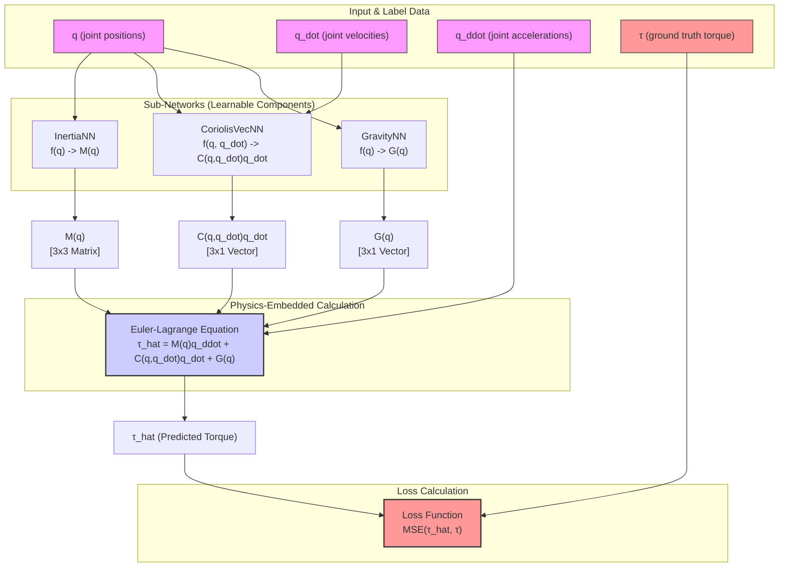

# Math, Architecture, and Pseudocode for the Equation-Embedded Neural Network (E2NN)

This document details the mathematical formulation, architectural flowchart, and implementation logic for the Equation-Embedded Neural Network (E2NN) used in `e2nn_train_plus_visualize.py`.

---

## 1. Architectural Flowchart

The following diagram illustrates the data flow within the E2NN model, from input features to the final loss calculation. It shows how the three sub-networks are used to construct the terms of the Euler-Lagrange equation.



---

## 2. The Physics: Euler-Lagrange Dynamics

The motion of a robotic arm can be described by the Euler-Lagrange equation. This equation provides a fundamental relationship between the torques applied to the system and its resulting motion.

The standard form of this equation for a 3-joint robot is:

\[ \tau = M(q)\ddot{q} + C(q, \dot{q})\dot{q} + G(q) \]

### Detailed Term Definitions:

-   **State Vectors**:
    -   **Joint Positions \(q\)**: \(q = \begin{bmatrix} q_1 \\ q_2 \\ q_3 \end{bmatrix}\)
    -   **Joint Velocities \(\dot{q}\)**: \(\dot{q} = \begin{bmatrix} \dot{q}_1 \\ \dot{q}_2 \\ \dot{q}_3 \end{bmatrix}\)
    -   **Joint Accelerations \(\ddot{q}\)**: \(\ddot{q} = \begin{bmatrix} \ddot{q}_1 \\ \ddot{q}_2 \\ \ddot{q}_3 \end{bmatrix}\)

-   **Torque Vector \(\tau\)**: The applied joint torques, which we aim to predict.
    \[ \tau = \begin{bmatrix} \tau_1 \\ \tau_2 \\ \tau_3 \end{bmatrix} \]

-   **Mass Matrix \(M(q)\)**: A `[3 x 3]` symmetric, positive-definite matrix that depends on joint positions \(q\). It relates joint accelerations to inertial forces.
    \[ M(q) = \begin{bmatrix} M_{11}(q) & M_{12}(q) & M_{13}(q) \\ M_{21}(q) & M_{22}(q) & M_{23}(q) \\ M_{31}(q) & M_{32}(q) & M_{33}(q) \end{bmatrix} \]

-   **Coriolis and Centrifugal Vector \(C(q, \dot{q})\dot{q}\)**: A `[3 x 1]` vector representing velocity-dependent forces.
    \[ C(q, \dot{q})\dot{q} = \begin{bmatrix} c_1(q, \dot{q}) \\ c_2(q, \dot{q}) \\ c_3(q, \dot{q}) \end{bmatrix} \]

-   **Gravity Vector \(G(q)\)**: A `[3 x 1]` vector of torques needed to counteract gravity, dependent on joint positions.
    \[ G(q) = \begin{bmatrix} g_1(q) \\ g_2(q) \\ g_3(q) \end{bmatrix} \]

---

## 3. The Neural Network Architecture (E2NN)

The E2NN embeds the physical structure of the dynamics equation. We create three specialized sub-networks to learn each component.

-   **`InertiaNN` (\(M_{NN}(q)\))**: This network learns the mass matrix.
    -   **Input**: Joint positions \(q\) (shape `[batch_size, 3]`).
    -   **Output**: A 9-element vector that is reshaped into the `[3 x 3]` mass matrix \(M_{NN}\).

-   **`CoriolisVecNN` (\(C_{NN}(q, \dot{q})\))**: This network learns the complete Coriolis and centrifugal effects vector.
    -   **Input**: Joint positions \(q\) and velocities \(\dot{q}\), concatenated together (shape `[batch_size, 6]`).
    -   **Output**: The `[3 x 1]` Coriolis vector \(C_{NN}\).

-   **`GravityNN` (\(G_{NN}(q)\))**: This network learns the gravity vector.
    -   **Input**: Joint positions \(q\) (shape `[batch_size, 3]`).
    -   **Output**: The `[3 x 1]` gravity vector \(G_{NN}\).

---

## 4. The Forward Pass: Calculating Predicted Torque

The `forward` method of the `E2NN` class combines the outputs of the sub-networks to predict the final torque, \(\hat{\tau}\).

The equation is implemented as:
\[ \hat{\tau} = M_{NN}(q) \ddot{q} + C_{NN}(q, \dot{q}) + G_{NN}(q) \]

In PyTorch, the matrix-vector multiplication \(M_{NN}(q) \ddot{q}\) is handled efficiently for batches using `torch.bmm` (batch matrix multiplication).

1.  `q_ddot` (shape `[batch_size, 3]`) is unsqueezed to `[batch_size, 3, 1]`.
2.  `torch.bmm` multiplies `M_NN` (shape `[batch_size, 3, 3]`) and the unsqueezed `q_ddot`.
3.  The result (shape `[batch_size, 3, 1]`) is squeezed back to `[batch_size, 3]`.
4.  This result is added to the outputs of the Coriolis and Gravity networks to get the final predicted torque \(\hat{\tau}\).

---

## 5. Training Process

The model is trained by minimizing the difference between its predicted torque (\(\hat{\tau}\)) and the actual torque (\(\tau\)) from the dataset.

-   **Loss Function**: We use the **Mean Squared Error (MSE)**. For a batch of N samples, the loss is:
    \[ \text{Loss} = \frac{1}{N} \sum_{i=1}^{N} || \tau_i - \hat{\tau}_i ||^2_2 \]
    where \(||\cdot||^2_2\) is the squared L2 norm (sum of squared elements).

-   **Data Handling**: Before training, the input features (`q`, `q_dot`, `q_ddot`) from the training set are standardized using `StandardScaler` from scikit-learn. The scaler is then applied to the test set to ensure consistency.

---

## 6. Pseudocode for Training

Below is a high-level overview of the `train_model` function.

```plaintext
FUNCTION train_model(hyperparameters, data_path):
    # 1. Setup
    CREATE output_directory for this run

    # 2. Load and Prepare Data
    LOAD data from data_path into pandas DataFrame
    EXTRACT feature vectors q, q_dot, q_ddot and target vector y (tau)
    SPLIT data into training and testing sets (maintaining original indices)

    # 3. Scale Features
    CREATE StandardScaler for q, q_dot, q_ddot
    FIT scaler on training data
    TRANSFORM both training and testing data with the fitted scaler

    # 4. Create PyTorch DataLoaders
    CONVERT numpy arrays to PyTorch Tensors
    CREATE TensorDataset for training and testing sets
    CREATE DataLoader for training and testing sets to handle batching

    # 5. Initialize Model
    INITIALIZE E2NN model, MSELoss criterion, Adam optimizer, and EarlyStopping

    # 6. Training Loop
    FOR each epoch from 1 to max_epochs:
        SET model to train mode
        FOR each batch (q, q_dot, q_ddot, y_true) in train_loader:
            ZERO gradients in optimizer
            
            # Forward pass
            y_pred = model(q, q_dot, q_ddot)
            
            # Compute loss and backpropagate
            loss = criterion(y_pred, y_true)
            loss.backward()
            optimizer.step()
        
        # Validation
        SET model to eval mode
        CALCULATE validation loss on the entire test_loader
        PRINT epoch, train_loss, val_loss
        
        # Early stopping check
        CALL early_stopping with val_loss
        IF early_stopping.early_stop is True:
            BREAK loop

    # 7. Save Results
    SAVE trained model state dictionary
    SAVE loss plot
    CALCULATE final performance metrics (MSE, MAE, R²) on the test set
    SAVE performance metrics to a text file
    GENERATE and save predictions CSV file
    SHOW "Training Complete" message
``` 